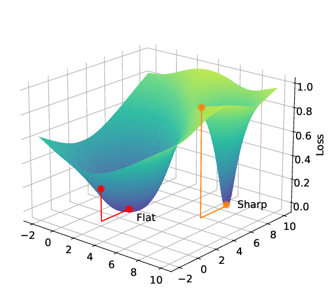

# Sharpness-Aware Minimization
Optimizing model parameters remains a challenging problem for researchers, as it plays a crucial role in enhancing the performance of generative models. Modern deep learning models are often highly overparameterized, capable of memorizing the entire training set. This leads to the problem of overfitting, reducing the model’s generalization capability for unseen data.

On 3 Oct 2020, Sharpness-Aware Minimization (SAM) was first introduced in the paper titled "Sharpness-Aware Minimization for Efficiently Improving Generalization" by Pierre Foret, Ariel Kleiner, Hossein Mobahi, and Behnam Neyshabur. Generally, SAM can optimize the function better than other optimizers in some situations by finding the noise on the training data, which makes the loss function max, plus parameters (weights) that help them adapt better to the changes in testing data. SAM aims to reduce the sharpness of minima to ensure the model is more stable on new data.

# Definitions

Sharpness indicates the model's sensitivity to small changes in its parameters (weights). There are two types of Sharpness: Sharp Minimum - A point in the loss function where the loss value changes significantly in response to small variations in the model parameters and Flat Minimum - A point in the loss function where the loss function changes little for small parameter perturbations, leading to a more stable and better-generalizing model. .

Noise refers to the difference between training data and testing data or the sensitivity of parameters to changes. Certainly, we are unaware of the risks associated with testing data, such as unseen data, missing data, etc., which can negatively affect the model's generalization. The main point of SAM is to find the loss-max-function noise to solving **Overfitting** and **Underfitting** problem.

# SAM Optimization Problem

The SAM optimization problem is given by:

$$L_D(w) \leq \max_{\| \epsilon \|_2 \leq \rho} L_S(w + \epsilon) + h \left( \frac{\| w \|_2^2}{\rho^2} \right)$$

Where $`h: \mathbb{R}_+ \to \mathbb{R}_+`$ is a strictly increasing function (under some technical conditions on \( L_D(w) \)).

- $` L_D(w) `$: Expected loss on the dataset with distribution $`\mathcal{D}`$.
- $` L_S(w) `$: Training loss on the training set $`S `$.
- $` \epsilon `$: A small perturbation added to the parameter $` w ,  where  \| \epsilon \| \leq \rho `$.
- $` \rho `$: A hyperparameter that controls the scope of the neighborhood for $` w `$.
- $` h: \mathbb{R}_+ \to \mathbb{R}_+`$: A strictly increasing function used to regularize the complexity of the model.

**Datasets and Perturbation Impact:**

In real-world applications, datasets used for testing often differ significantly from training datasets. This reflects unseen data, varying parameters, and different scenarios. This distinction is crucial for calculating the loss $` L_D(w) `$. Given this, the relationship between the test and training weights can be expressed as: $`w_{\text{Test}} = w_{\text{Train}} + \epsilon`$. Where $` \epsilon `$ represents the perturbation or the difference between the weights on the Test and Train datasets.

**Solutions:**

By using SAM, we can identify $` \epsilon `$ such that when added to $` w_{\text{Train}} `$, it maximizes the loss gradient:

$$\max_{\| \epsilon \|_2 \leq \rho} L_S(w + \epsilon)$$

This optimization step allows us to find the sharpest direction that increases the loss. By then finding the flatter minima from the opposite side of that direction (which helps in reducing loss), SAM helps $` w_{\text{Train}} `$ adapt better to the test dataset, thereby improving generalization performance. .

# How SAM works

### 1. Maximize Perturbation:

Predict $` \epsilon^\star `$ which maximizes the loss $` L_S(w + \epsilon) `$ within the perturbation radius $` \| \epsilon \|_2 \leq \rho `$:

$$
\epsilon^\star = \arg \max_{\| \epsilon \|_2 \leq \rho} L_S(w + \epsilon)
$$

### 2. First-Order Taylor Expansion:

If $` f(x) `$ is differentiable at the point $` x_0 = a `$, then it has a linear approximation near this point:

$$
f(x) \approx f(a) + f'(a)(x - a)
$$

### 3. Applying the First-Order Taylor Expansion:

Consider $` x_0 = w `$ and set $` f(x) = L_S(w + \epsilon) `$. We have the perturbation $` \epsilon `$. Applying the First-Order Taylor expansion, we get:

$$
\epsilon^\star(w) \approx \arg \max_{\| \epsilon \|_2 \leq \rho} \left( L_S(w) + \epsilon^T \nabla_w L_S(w) \right)
$$

This simplifies to:

$$
\epsilon^\star(w) \approx \arg \max_{\| \epsilon \|_2 \leq \rho} \epsilon^T \nabla_w L_S(w)
$$

### 4. Transform the Perturbation Calculation Formula
Set $`\nabla_w L_S(w)`$  as  $`g `$.

Assume that $` \epsilon^T `$ and $` g `$ are vectors with $` n `$ elements.

Then, we apply **Hölder's inequality**:

$$
\sum_{i=1}^n |\epsilon_i g_i| \leq \|\epsilon\|_p \|g\|_q \quad \text{which implies} \quad \epsilon^T g \leq \|\epsilon\|_p \|g\|_q
$$

Where $` p `$ and $` q `$ are conjugate exponents such that $` \frac{1}{p} + \frac{1}{q} = 1 `$.

The equality holds when:

$$
\frac{|\epsilon_i|^p}{\|\epsilon\|_p^p} = \frac{|g_i|^q}{\|g\|_q^q}, \quad \text{for all} \quad i \in \{1, 2, \dots, n\}
$$

This is equivalent to:

$$
|\epsilon_i|^p = \frac{\|\epsilon\|_p^p}{\|g\|_q^q} |g_i|^q, \quad \text{for all} \quad i \in \{1, 2, \dots, n\}
$$

And further simplifies to:

$$
|\epsilon_i| = \frac{\|\epsilon\|_p}{\|g\|_q^{q/p}} |g_i|^{q/p}, \quad \text{for all} \quad i \in \{1, 2, \dots, n\}
$$

Substituting $` g = \nabla_w L_S(w) `$ into the equation, we get the following:

$$
|\epsilon_i| = \frac{\|\epsilon\|_p}{\|g\|_q^{q-1}} |g_i|^{q-1}, \quad \text{for all} \quad i \in \{1, 2, \dots, n\}
$$

This leads to the equation:

$$
\epsilon_i = \frac{\|\epsilon\|_p \cdot \text{sign}(\nabla_w L_S(w)_i) \cdot |\nabla_w L_S(w)_i|^{q-1}}{\|\nabla_w L_S(w)\|_q^{q-1}}, \quad \forall i = 1, \dots, n
$$

We have the following conditions:

$$
\epsilon^\star(w) \leq \arg \max_{\|\epsilon\|_p \leq \rho} \epsilon^T \nabla_w L_S(w)
$$

Through empirical evidence, it is found that \( p = 2 \) is typically optimal, which leads to $`\|\epsilon\| \leq \rho \quad \text{and} \quad q = 2`$. This implies:

$$
\epsilon^T \nabla_w L_S(w) = \|\epsilon\| \|\nabla_w L_S(w)\| \cos(\alpha) \leq \|\epsilon\| \|\nabla_w L_S(w)\| \leq \rho \|\nabla_w L_S(w)\|
$$

When the equality " = " appears, we have: $`\|\epsilon\| = \rho`$

This leads to:

$$
\epsilon_i = \frac{\rho \cdot \nabla_w L_S(w)_i}{\|\nabla_w L_S(w)\|_2}, \quad \text{for all} \quad i \in \{1, 2, \dots, n\} \quad (\ast)
$$

Combining all the results, we obtain the solution $` \hat{\epsilon}(w) `$ that satisfies:

$$
L_{\text{SAM}}(w) \triangleq \max_{\|\epsilon\|_p \leq \rho} L_S(w + \epsilon)
$$

We have the following approximation for the gradient of the SAM loss:

$$
\nabla_w L_{\text{SAM}}(w) \approx \nabla_w L_S(w + \hat{\epsilon}(w)) = \frac{d(w + \hat{\epsilon}(w))}{dw} \nabla_w L_S(w) \bigg|_{w + \hat{\epsilon}(w)}
$$

This expands to:

$$
\nabla_w L_S(w + \hat{\epsilon}(w)) = \nabla_w L_S(w + \hat{\epsilon}(w)) + \frac{d \hat{\epsilon}(w)}{dw} \nabla_w L_S(w) \bigg|_{w + \hat{\epsilon}(w)}
$$

### 5. Final Gradient Update:

- The gradient of the SAM loss is approximated as:

$$
\nabla_w L_{\text{SAM}}(w) \approx \nabla_w L_S(w + \hat{\epsilon}(w))
$$

- The updated weight is computed as:

$$
w_{t+1} \leftarrow w_t - \eta \nabla_w L_{\text{SAM}}(w)
$$

# SAM Results on Different Datasets

SAM has been tested on datasets like CIFAR-10, Kmnist, and FashionMNIST showing significant improvements.

| Dataset      | Test Accuracy (%) |
|--------------|-------------------|
| KMNIST       | 98                |
| FashionMNIST | 93                |
| CIFAR-10     | 84                |

Based on the knowledge from that paper, we continue learning about variants of SAM that can be applied to solving optimization problems: SSAMF, SSAMD, FriendlySAM, and IMBSAM. The source code is implemented in Python using the PyTorch framework and applied with a multivariable function.
